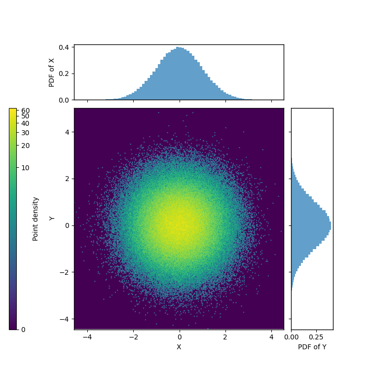

## My example

This repository extends the original mpl-scatter-density example by adding my own implementation for visualizing 2D Gaussian-distributed data with customized layout.
It includes a main density scatter plot, marginal histograms, and a left-side colorbar whose ticks and label are aligned on the left.
This layout provides a clean, publication-ready visualization style for large datasets and statistical analysis.

```bash
python3 examples/my_example.py 
```




## Credits

This project includes code adapted from  
[Thomas P. Robitaille’s repository](https://github.com/astrofrog/mpl-scatter-density),  
© 2016–2017, licensed under the BSD 2-Clause License.  
See the [LICENSE](./LICENSE) file for details.
